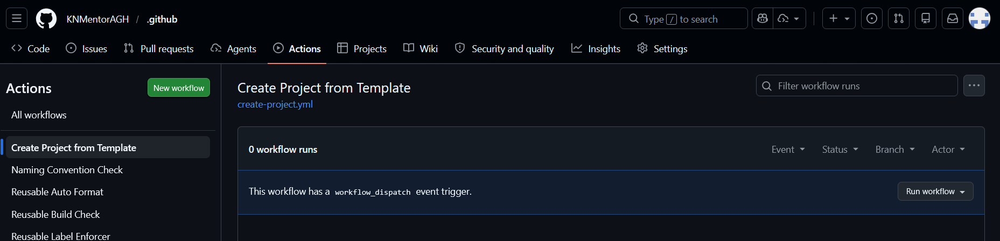

# Instrukcja tworzenia nowych repozytoriów

Proces tworzenia projektów jest w pełni zautomatyzowany: **Nigdy nie twórz repozytoriów ręcznie przez interfejs GitHub, ponieważ nie będą one posiadały wymaganych zabezpieczeń i konfiguracji**.

# Procedura krok po kroku

1. Przejdź do repozytorium `.github`
2. W górnym menu wybierz `Actions`.
3. Po lewej stronie kliknij w `Create Project from Template`.

4. Kliknij przycisk `Run workflow` po prawej stronie i wypełnij formularz:

    - **Repository name**: Nazwa w formacie kebab-case (np. zlecenia-velen)
    - **Team slug**: Nazwa (slug) zespołu, który ma otrzymać uprawnienia maintain (np. projekt-yennefer)
    - **Project Leader**: Nazwa użytkownika GitHub osoby, która zostanie wpisana do CODEOWNER
    - **Visibility**: Wybierz public lub private

# Co dzieje się automatycznie?

Po kliknięciu "Run workflow", system wykona następujące operacje:

1. **Walidacja**: Sprawdzenie czy nazwa jest poprawna i czy istnieje repo o tej samej nazwie.
2. **Inicjalizacja**: Stworzenie repozytorium na bazie szablonu KNMentorAGH/template.
3. **Ustawienia bazowe**: Wyłączenie Merge Commitów, wymuszenie Squash Merge oraz ustawienie main jako domyślnej gałęzi.
4. **Dostęp i Role**: Przypisanie wskazanego zespołu do repozytorium oraz ustawienie Lidera jako jedynej osoby uprawnionej do akceptacji zmian w CODEOWNERS.
5. **Branch Protection**: Nałożenie blokady na gałąź main, w tym:
    - Wymóg przejścia wszystkich testów i formatowania
    - Zakaz bypassowania zasad przez administratorów (enforce_admins: true)
    - Automatyczne kasowanie zatwierdzeń po nowym commicie

# Postępowanie w razie błędów

Skrypt posiada wbudowany mechanizm Atomic Rollback:

- Jeśli którykolwiek krok konfiguracji (np. nadawanie uprawnień) zawiedzie, workflow automatycznie usunie nowo stworzone repozytorium.
- W przypadku błędu, sprawdź logi w zakładce Actions, popraw parametry (np. błędny login lidera) i spróbuj ponownie.

Jeśli nie działa, a wszystko jest zrobione dobrze - skontaktuj się z przewodniczącym koła.